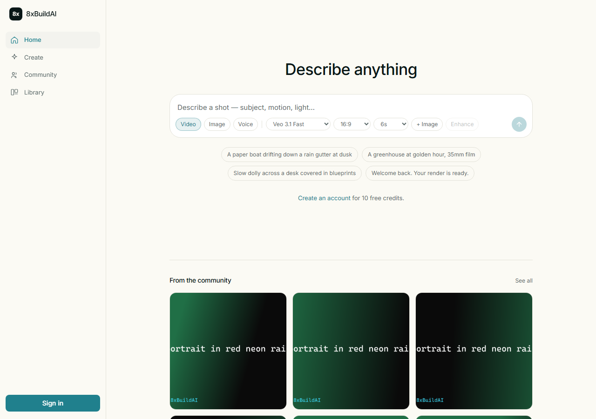

# 8xBuildAI

A creative-AI generation platform — text and images in, video / image / audio
out. Scope came from the Higgsfield screenshots in `higgsfieldscreenshots/`;
the interface was later rebuilt on the ChatGPT / Perplexity reference.



## Run it

Two processes. Node 22.5+ and ffmpeg on PATH.

```bash
# terminal 1 — API on :8787
cd server
npm install
npm start

# terminal 2 — web on :5173
cd web
npm install
npm run dev
```

Open <http://localhost:5173>, create an account, and you get 10 credits.
A video costs 5, an image 1, speech 2.

## What it does

- **Video** — Veo 3.1, text-to-video and image-to-video. Real clips, with audio.
- **Image** — Gemini 2.5 Flash Image.
- **Voice** — Gemini TTS.
- **Prompt rewriting** — Azure OpenAI turns `a cat in a city` into a full shot
  description before it reaches the model. The original is kept, shown under
  the result, and undoable.
- **Community** — publish a video or image, browse the feed, like what others
  made.

## Keys

```
GEMINI_API_KEY=...         # generation — required for real output
AZURE_OPENAI_ENDPOINT=...  # prompt rewriting — optional
AZURE_AI_API_KEY=...
AZURE_AI_MODEL=...
```

In `server/.env` or the repo-root `.env` — either is read, and spaces or quotes
around the value are fine. Keys stay server-side; the browser never sees one.

Verify them:

```bash
cd server
npm run check:gemini   # auth, plus which models this key can actually use
npm run check:azure    # rewriter round trip, prints a before/after
```

**Without `GEMINI_API_KEY` the app still runs.** A local ffmpeg renderer serves
every generation with a real, playable MP4 / PNG / M4A, watermarked `SIMULATED`
and flagged `simulated: true` by the API — so a demo can never be mistaken for
real model output.

## Layout

```
server/     Express 5 API, node:sqlite, job worker, providers
  src/providers/    gemini.js + simulator.js behind one interface
  src/azure.js      prompt rewriting (text only, never media)
  scripts/          check-gemini.js, check-azure.js
web/        Vite + React + TypeScript + Tailwind
  qa/flow.mjs             browser pass over the critical flow (free)
  qa/real-providers.mjs   the same against real models (billed)
shared/     PROJECT, DESIGN, STATUS, TASKS, DECISIONS, BUGS
.agents/    Agent role definitions this build followed
.agent-logs/  Full prompt/response capture for every session
```

## Verify

```bash
cd web
npx playwright install chromium   # once
node qa/flow.mjs                  # 40 checks, free, ~2 min
node qa/real-providers.mjs        # 7 checks against the real models — billed
```

`flow.mjs` drives a real browser through signup → prompt → enhance → generate →
processing → completed → preview → download → publish → like, plus credit
limits, auth redirects, unknown routes, mobile layout, and that light and dark
actually render differently. It pins the local renderer deliberately, so running
it often costs nothing.

`real-providers.mjs` is the opt-in one: it spends real credits on Veo and Gemini
and asserts the files that come back are genuine — `simulated: false`, and large
enough to be real media.

## Deploy

Everything runs on Vercel as one project: the static site plus a single
serverless function (`api/[...slug].js`) serving the same Express app.

```bash
vercel deploy --prod
```

Required production environment variables:

| Variable | Purpose |
|---|---|
| `TURSO_DATABASE_URL` / `TURSO_AUTH_TOKEN` | the database — libSQL, same SQLite dialect |
| `BLOB_READ_WRITE_TOKEN` | generated media (set by `vercel storage connect`) |
| `GEMINI_API_KEY` | generation |
| `AZURE_*` | prompt rewriting |
| `SESSION_SECRET` | session signing |
| `ALLOW_SIMULATOR=false` | ffmpeg cannot run on Vercel; see below |

Locally none of these are needed: the database falls back to a plain file and
media to local disk, so `npm start` works with no account.

**The `sim-*` models are local-only.** They shell out to ffmpeg, which is not
available in the serverless runtime, so in production a missing
`GEMINI_API_KEY` means no generation at all rather than watermarked local
output. `shared/decisions.md` 013 has the reasoning.

## Interface

Rebuilt on the ChatGPT / Perplexity reference: one composer that is also the
home screen, a slim rail, an 820px content column, Perplexity brand colours in
light and dark, and one accent on one action. See `shared/RESEARCH.md` for the
patterns and `shared/DESIGN.md` for the tokens.

## Notable decisions

- **`node:sqlite`, not `better-sqlite3`** — no native toolchain, so a Windows
  clone installs cleanly. See `shared/decisions.md` 004.
- **Two providers behind one interface** — the product runs and demos with no
  third-party key or credit card. See 003.
- **Credits are transactional** — deducted with the job insert in one
  transaction, refunded when a job fails. Verified end to end.
- **Rewriting and generation are separate services** — a rewriter outage cannot
  stop generation. See 008.
- **Community is a flag on a generation**, not a copied post row: one source of
  truth for the media, and unpublish is one UPDATE. See 009.
- **The test suite uses the local renderer.** Once a Gemini key is present the
  default model is Veo, and a suite that ran real video generation on every
  change would be indefensible. See 010.

`shared/BUGS.md` records what broke on the way — a UI race that left generations
stuck on "Queued" for 931 seconds while the server had long since finished them,
a 5-second video that weighed 47MB, and a landing hero that collapsed because an
animation class set `display: inline-block` on a grid.
